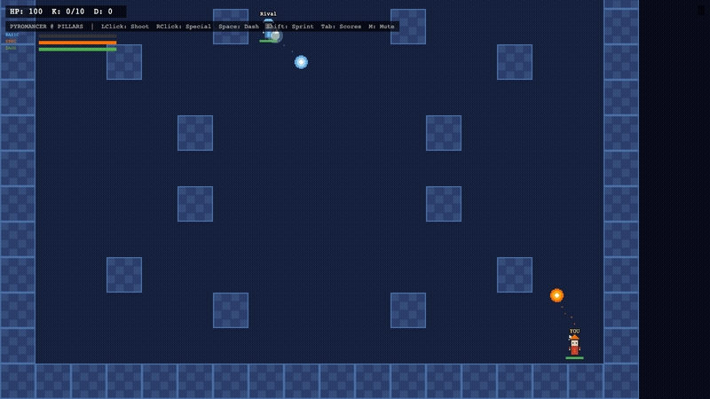
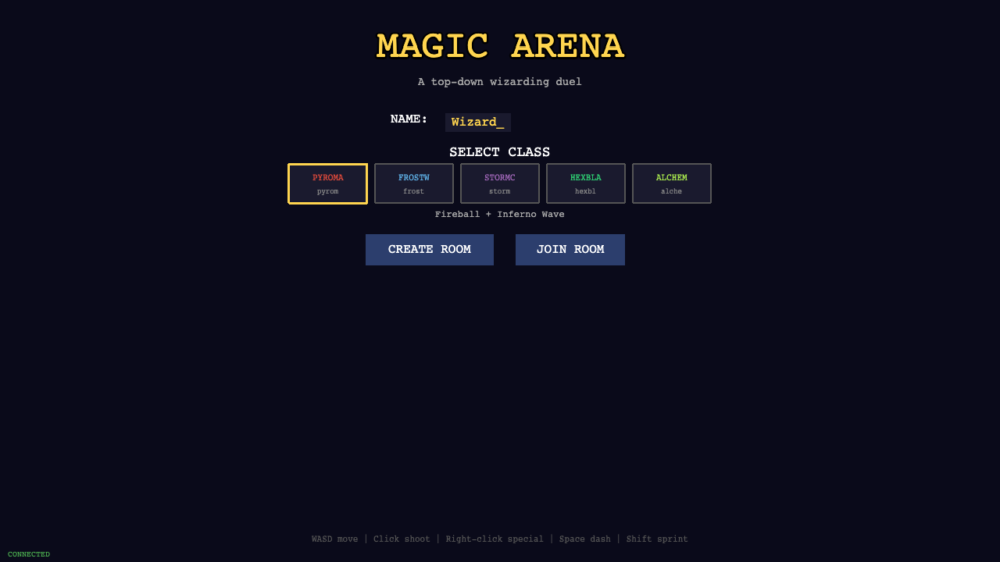
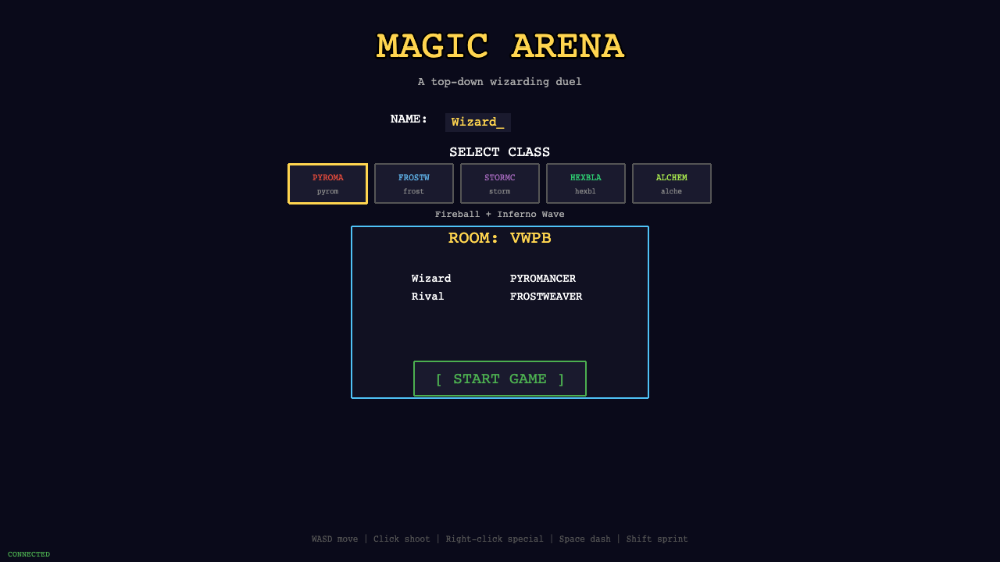
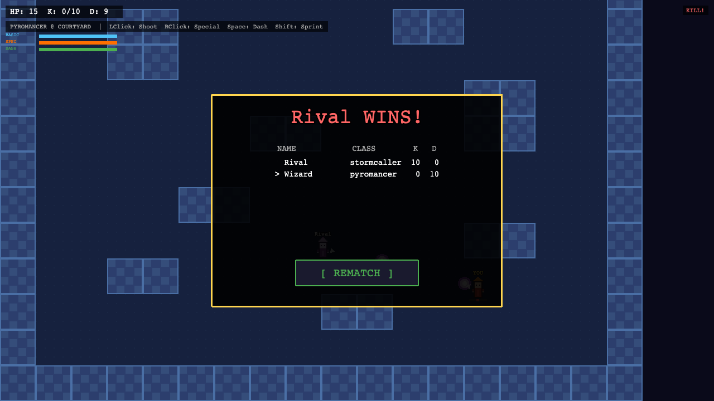
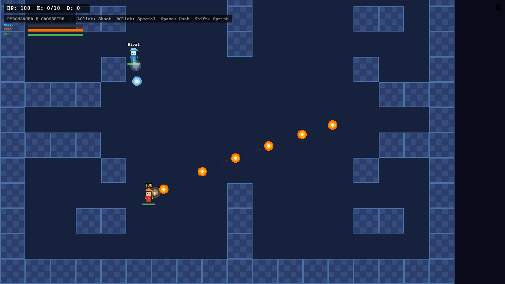

# Magic Arena

A 2D top-down multiplayer wizard PvP game that runs entirely in the browser. Pick one of five spell classes, create a room, share the four letter code with friends, and fight until someone reaches 10 kills.

Built with Phaser 3 on the client and Node.js with Socket.IO on the server. The server owns the whole simulation, so there is no client side cheating: clients only send input and render what the server tells them.



## Quick start

```bash
cd server
npm install
npm start
```

Open http://localhost:3000 in two browser tabs (or send the room code to a friend on your network) and start fighting.

## How a match works

1. One player clicks CREATE ROOM and gets a four letter code.
2. Up to 8 players join with that code and pick a class in the lobby.
3. Anyone presses START GAME. The server picks one of three arenas at random.
4. First player to 10 kills wins. A scoreboard appears with a rematch button.
5. Rematch starts a fresh match, new random map, scores reset.





## Controls

| Input       | Action                          |
|-------------|---------------------------------|
| W/A/S/D     | Move                            |
| Mouse       | Aim                             |
| Left click  | Basic attack (hold to auto fire)|
| Right click | Special ability                 |
| Space       | Dash                            |
| Shift       | Sprint                          |
| Tab (hold)  | Live scoreboard                 |
| M           | Mute sound                      |

## Classes

| Class       | Basic attack      | Special ability                                  |
|-------------|-------------------|--------------------------------------------------|
| Pyromancer  | Fireball          | Inferno Wave: cone of fire that burns over time  |
| Frostweaver | Ice Shard (slows) | Glacial Wall: temporary wall that blocks movement|
| Stormcaller | Chain Bolt        | Thunder Strike: delayed AoE blast at range       |
| Hexblade    | Melee slash       | Shadow Bind: projectile that roots the target    |
| Alchemist   | Acid Flask        | Transmute Field: zone that heals you, then hurts enemies |

You can switch class while waiting to respawn, so counterpicking mid match is part of the game.

Other mechanics: killing someone heals you 25 HP, everyone slowly regenerates, fresh spawns get 2 seconds of protection, and every hit applies knockback.





## Project structure

```
magic-arena/
├── server/
│   ├── index.js     Express static server + Socket.IO + all game logic
│   └── package.json
└── client/
    ├── index.html   Entry point
    ├── main.js      Phaser config
    ├── menu.js      Menu and lobby scene
    ├── scene.js     Game scene: rendering, input, interpolation
    ├── sfx.js       Sound effects synthesized with WebAudio (no audio files)
    └── sprites.js   Pixel art sprites generated at runtime (no image assets)
```

## Architecture notes

- **Server authoritative.** The server runs each room's simulation at 60 fps and handles movement, collision, damage, status effects, and win detection. Clients send `{dx, dy, angle, sprint}` input and ability requests, nothing else.
- **Client interpolation.** Remote players lerp toward their latest server position so movement looks smooth even though state arrives in discrete ticks.
- **Runtime generated assets.** All sprites are drawn to canvases at startup in `sprites.js`, and every sound is synthesized with WebAudio in `sfx.js`. The repo has no image or audio files and no build step.
- **Rooms are isolated.** Each room has its own game loop, map, and state. Empty rooms are cleaned up when the last player disconnects.

## Tuning

Game balance lives in two places in `server/index.js`:

- `CLASSES` defines every class stat: move speed, dash, cooldowns, damage.
- The constants above it (`KILL_LIMIT`, `RESPAWN_TIME`, `SIPHON_HEAL`, `PASSIVE_REGEN`, and so on) control match rules.

Maps are plain string arrays in the `MAPS` object. `#` is a wall, `.` is floor, each cell is 64 pixels. Add a new layout there and it joins the random rotation automatically.

## Deploying

The server reads `PORT` from the environment, so it works out of the box on most Node hosts (Render, Railway, Fly.io, a VPS).

```bash
# from the repo root
npm install
npm start
```

For Render or Railway: point the service at the repo, build command `npm install`, start command `npm start`. Once deployed, everyone with the URL can play together with room codes. WebSockets must be enabled on the host (they are by default on Render and Railway).

## License

MIT
